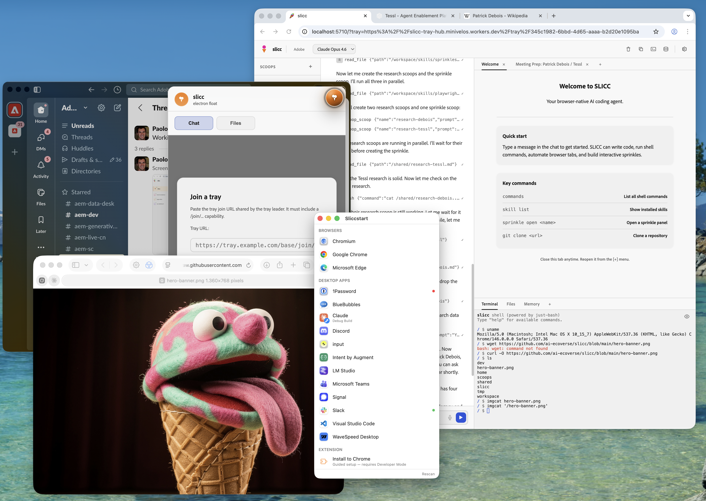

You are looking at a macOS desktop, with four windows running:

1. Google Chrome, running SLICC as a web application. It shows a Welcome page, a hidden tab with meeting preparation notes that were created by the agent, and a terminal, showing that the operating system is of the unlikely `Mozilla/5.0` kind. What?
2. Slack, the desktop app. Err. Slack the Electron app. It has on overlay injected, showing the ice cream logo asking to join a tray. If you do this, Slack can be remote-controlled by your agent. What the?
3. Sliccstart, the desktop app. It's an actual macOS app, but one that controls browsers, and browsers that prentend to be native apps alike. What the ice cream?
4. An image of an antropomorphized ice cream cone made out of felt and googly eyes. It's sticking out its tongue, half in astonishment, half in anticipation. What the ice cream truck?

If this scares, confuses, or excites you, keep reading.

# slicc — Self-Licking Ice Cream Cone

[](https://github.com/ai-ecoverse/vibe-coded-badge-action)

[](https://www.npmjs.com/package/sliccy)

> A browser-native AI agent for getting practical work done in and through the browser.

SLICC runs in a browser and controls the browser it runs in. It combines a shell, files, browser automation, and multi-agent delegation so you can do real work from one workspace — coding, web automation, authenticated app tasks, and the weird in-between jobs that do not fit neatly inside a chat panel. SLICC can orchestrate multiple browsers, and even some apps through telepathy, making it a powerful hub for your digital work.

- Head over to [releases](https://github.com/ai-ecoverse/slicc/releases) and grab the latest `.dmg` file. No Windows or Linux UI yet
- Or launch it from the CLI today (we also have a Chrome extension)
- Connect other browser windows or Electron apps
- Install skills that teach it how to perform challenging tasks
- Give it practical tools models already know how to use
- Delegate parallel work so tasks get done faster

> Status: active working prototype. The macOS app is the easiest way in today; and we have submitted the extension to Chrome Web Store.

## Why SLICC is different

- **Browser-native, not browser-adjacent.** The agent runtime lives in the browser, and the agent can act on the same browser it lives in. A great mix of power and containment. If you don't like what the AI does, close the browser tab and it's over.
- **A real shell environment.** Many browser agents are constrained by the tools provided to them. SLICC has an almost-too-real shell with commands like `git`, "`node`", `python`, `playwright`, built-in.
- **UI on the fly.** SLICC can generate rich user interfaces on the fly. These can be small visualizations in a chat response, or full-blown web applications that run in a sidebar, or even a separate tab.
- **Built around Skills.** Agents don't suffer from missing capabilities, they suffer from skill issues. SLICC has a powerful skills system and a skills marketplace to find and install new skills to support your work.
- **More than a coding panel.** Coding is one strong use case, but SLICC is built for practical browser work too: authenticated web apps, repetitive tab work, content operations, debugging, research, and automation.
- **Works across runtimes.** Start in the CLI, run as a Chrome extension, connect multiple tray sessions, or attach to Electron apps with the same core model.
- **Delegates in parallel.** The main agent can spin up isolated sub-agents for task-specific work instead of stuffing everything into one conversation.

## Who it is for

SLICC is for you if:

- you spend a lot of your day in browsers, terminals, and web apps
- you want an agent that can act, not just answer
- you are curious about automation, shell tools, and technical workflows
- you want one system that can span local dev work, browser tasks, and Electron surfaces
- you are an AI/web-dev-adjacent builder, power user, who's comfortable with things being broken from time to time (we are working hard to make this smoother)

## What you can do with it

- **Launch an agent from the CLI and let it work in the browser it controls.** Start one command, open the workspace, and give the agent shell tools, files, and live browser access in one place.
- **Automate repetitive workflows in authenticated web apps.** Use browser automation, page inspection, screenshots, storage access, and scripted tab control where your logged-in browser session already has the context.
- **Solve technical tasks with practical tools.** Reach for `bash`, `git`, `grep`, `node`, `python`, previews, and browser automation when the job is bigger than text generation.
- **Delegate parallel work to scoops.** Split tasks into isolated sub-agents with their own sandboxes and context, then let the main agent coordinate the results.
- **Turn one-off wins into reusable workflows.** Package behavior as skills, build interactive sprinkles, and react to external events with webhooks and cron-driven licks.
- **Mount your local file system.** By default, SLICC is confined to your browser. But you can ask it to mount folders from your local file system, so it can read and write from there.

## Getting started

### 1. Quick start with npx

The fastest way to try SLICC — no clone, no install:

```bash
npx sliccy
```

This downloads the latest release, launches Chrome, and opens the workspace. Configure your LLM provider in the first-run settings dialog. Requires Node >= 22.

### 2. Install globally

If you plan to use SLICC regularly:

```bash
npm install -g sliccy
slicc
```

### 3. Run from source (contributors)

```bash
git clone https://github.com/ai-ecoverse/slicc.git
cd slicc
npm install
npm start
```

- Optionally pre-configure providers: `cp providers.example.json providers.json`
- See [providers.example.json](providers.example.json) for the available provider fields.
- For contributor-focused setup details, see [docs/development.md](docs/development.md).

### 4. Chrome extension

The extension runs the same core experience as a Chrome side panel with no separate server process.

```bash
npm install
npm run build:extension
```

Load `dist/extension/` as an unpacked extension in `chrome://extensions`, then open the SLICC side panel.

### 5. Run a second browser

If you want to control a second browser (even on another machine), ask your main browser agent for a Tray Join URL. You can also type `host` in the built-in terminal, to get it. Copy that URL and launch a second browser throught the CLI.

In the dialog, click "Join Tray" and paste the URL. Once you connect, the sessions are fully synchronized.

### 6. Electron

SLICC can also attach to Electron apps and inject the same shared overlay into their pages. The best way to use it with Electron apps is to use the Join Tray feature, so that the Electron app becomes a remote-controllable target.

```bash
npm run dev:electron -- /Applications/Slack.app
```

For the full Electron workflow, see [docs/electron.md](docs/electron.md).

## Screenshots and proof

## How it works

SLICC shares one core across the CLI, extension, and Electron modes. The browser is not just where you view the product — it is where the agent runtime lives.

- **Browser-first runtime:** the agent loop, virtual filesystem, shell, UI, and tools run client-side.
- **Thin server where needed:** the CLI path mainly exists to launch Chrome, proxy CDP, and bridge the few things browsers cannot do alone.
- **One model across floats:** CLI, extension, tray/follower flows, and Electron all reuse the same underlying system.
- **Cone + scoops delegation:** the main agent orchestrates; sub-agents execute in isolated sandboxes and report back.
- **Skills explain the world to the agent:** don't expect the agent to know everything, ask it to search and install skills that are relevant to the task.

## The SLICC vocabulary and lore

Once the product makes sense, the ice-cream language is easier to enjoy: it maps to real architecture, not just mascot energy.

- **Cone** — the main agent you interact with. It holds the broad context, owns the overall workflow, and delegates work.
- **Scoops** — isolated sub-agents with their own filesystem sandbox, shell, and conversation history.
- **Licks** — external events that wake an agent up: webhooks, cron jobs, and other signals from the outside world.
- **Floats** — normal engineers would call it runtimes, but would normal engineers have come up with this?
- **Tray** — multiple floats can form a tray, a joint session with remote control.
- **Sprinkles** — everything is better with sprinkles: small, optional enhancements you can add on top of the core system.

Why the name? SLICC stands for **Self-Licking Ice Cream Cone**: a recursive system that can help build, extend, and operate itself. A browser agent running inside the browser: that's as self-recursive as tongue-out gelato.

## API Keys and Providers

To use SLICC, you need an LLM provider. SLICC is very much a BYOT (bring your own tokens) affair. We have built-in support for many providers, and these have actually been tested.

- Adobe (for AEM customers. Talk to the team to get enabled)
- AWS Bedrock (because enterprise)
- AWS Bedrock CAMP (this is Adobe-internal. Did I say "because enterprise" already?)
- Anthropic

The other providers are in YMMV territory. Please file an issue if you find them working or broken.

## Related projects and lineage

SLICC is part of the [AI Ecoverse](https://github.com/ai-ecoverse), a growing set of AI-native tools and workflows. Its distinctive angle is simple: browser-native, practical, and job-oriented.

- [yolo](https://github.com/ai-ecoverse/yolo) — worktree-friendly CLI launcher for AI agent workflows
- [upskill](https://github.com/ai-ecoverse/upskill) — installs reusable agent skills from other repositories (and built-in in SLICC)
- [ai-aligned-git](https://github.com/ai-ecoverse/ai-aligned-git) and [ai-aligned-gh](https://github.com/ai-ecoverse/ai-aligned-gh) — guardrails and attribution helpers for AI-assisted Git/GitHub work

SLICC would not have been possible without the pioneering inspiration of [OpenClaw](https://github.com/openclaw/openclaw), [NanoClaw](https://github.com/qwibitai/nanoclaw), and [Pi](https://github.com/badlogic/pi-mono). Pi is actually the frozen heart of every SLICC instance.

## Development and deeper docs

If you want to go deeper, the detailed docs live here:

- [Development guide](docs/development.md)
- [Architecture](docs/architecture.md)
- [Testing](docs/testing.md)
- [Shell reference](docs/shell-reference.md)
- [Adding features](docs/adding-features.md)
- [Electron notes](docs/electron.md)
